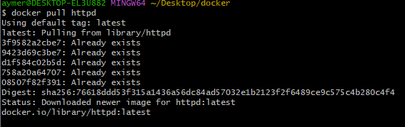
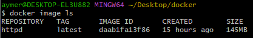
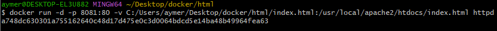

TP Conteneurs Docker
====================

5\. Exécuter un serveur web dans un conteneur Docker
----------------------------------------------------

Pour exécuter un serveur web (apache, nginx, ...) dans un conteneur Docker, nous avons suivi les étapes suivantes :

1.  Nous avons récupéré l'image sur le Docker Hub à l'aide de la commande `docker pull httpd`.

2.  Nous avons vérifié la presence de l'image httpd en local à l'aide de la commande `docker image ls`.

3.  Nous avons créé un fichier index.html simple dans le dossier html.
4.  Nous avons démarré un conteneur et servi la page HTML créée précédemment à l'aide d'un volume en utilisant la commande `docker run -d -p 8080:80 -v C:/Users/aymer/Desktop/docker/html/index.html:/usr/local/apache2/htdocs/index.html httpd` page html accessible sur http://localhost:8080.
