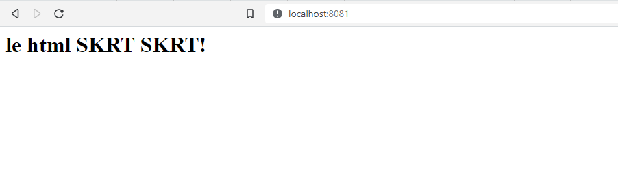
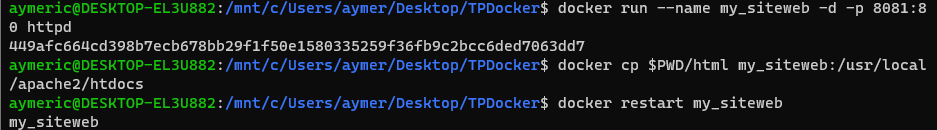
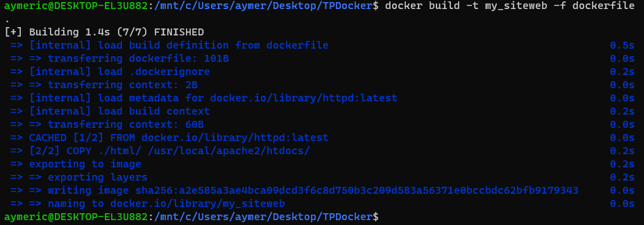
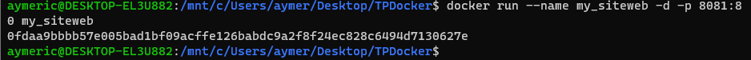
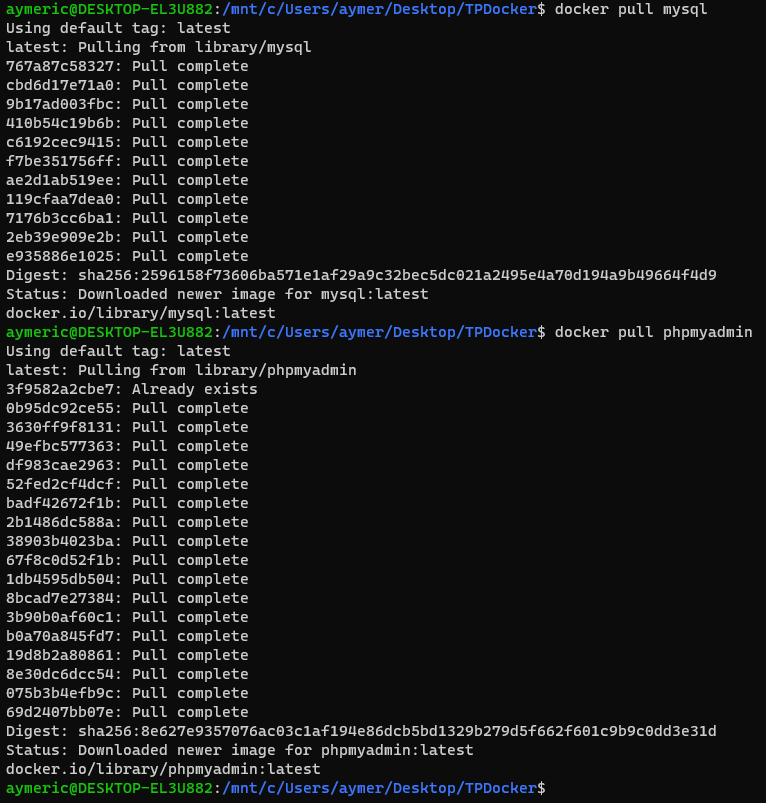
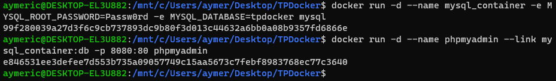
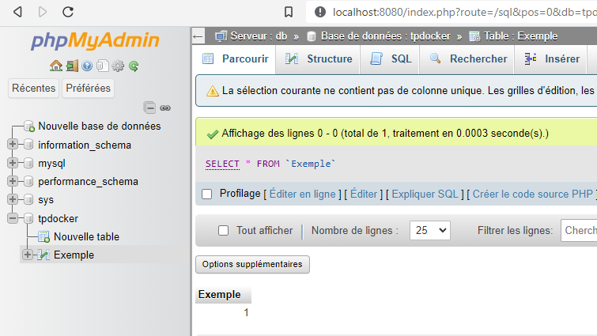
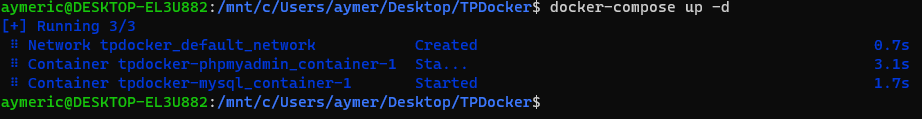

TP Conteneurs Docker
====================

5\. Exécuter un serveur web dans un conteneur Docker
----------------------------------------------------

Pour exécuter un serveur web (apache, nginx, ...) dans un conteneur Docker, nous avons suivi les étapes suivantes :

1.  Nous avons récupéré l'image sur le Docker Hub à l'aide de la commande `docker pull httpd`.

2.  Nous avons vérifié la presence de l'image httpd en local à l'aide de la commande `docker image ls`.

3.  Nous avons créé un fichier index.html simple dans le dossier html.
4.  Nous avons démarré un conteneur et servi la page HTML créée précédemment à l'aide d'un volume en utilisant la commande `docker run -d -p 8081:80 -v C:/Users/aymer/Desktop/docker/html/index.html:/usr/local/apache2/htdocs/index.html httpd` page html accessible sur http://localhost:8081.

5.  Nous avons supprimé le conteneur précédent et sommes arrivés au même résultat en utilisant ces commandes :
- `docker run --name my_siteweb -d -p 8081:80 httpd` pour creé le conteneur server web
- `docker cp $PWD/html my_siteweb:/usr/local/apache2/htdocs` pour copier le fichier index.html dans le conteneur.
- `docker restart my_siteweb` pour relancer le conteneur avec le nouveau fichier html

page html accessible sur http://localhost:8081.

6\. Builder une image
----------------------------------------------------
1. Après avoir remplis le dockerfile où l'on indique l'utilisation de la dernière version d'httpd et la commande pour copier le fichier html, on effectue la commande suivante à la racine du projet pour build l'image : `docker build -t my_siteweb -f dockerfile .`

2. On effectue la commande docker run sur l'image crée sur le port 8081:80 : `docker run --name my_siteweb -d -p 8081:8
0 my_siteweb`

page html accessible sur http://localhost:8081.

3. Les différences entre les procédures 5 et 6 sont que la procédure 5 utilise une image existante, tandis que la procédure 6 crée une nouvelle image à partir d'un Dockerfile. La procédure 6 offre plus de flexibilité et de contrôle sur l'image créée, alors que la procédure 5 est plus stable car cest une image fournis par docker hub.

7\. Utiliser une base de données dans un conteneur docker
----------------------------------------------------
1. On récupères les images docker de mysql et phpmyadmin grace à la commande docker pull 
2. On lance les conteneurs mysql et phpmyadmin en renseignant :
- les variables d'environements mysql (nom de la BDD et mot de passe) `docker run -d --name mysql_container -e MYSQL_ROOT_PASSWORD=Passw0rd -e MYSQL_DATABASE=tpdocker mysql`
- la liaison entre phpmyadmin et mysql `docker run -d --name phpmyadmin --link mysql_container:db -p 8080:80 phpmyadmin`

Ensuite, on se connecte sur phpmyadmin sur http://localhost:8080 grace au mot de passe renseigné prècédement et à l'identifiant 'root' pour ajouter un table et une donnée exemple dans la base 'tpdocker mysql'.

8\. Utilisation de docker-compose
---------------------------------
1. Nous avons utilisé un fichier docker-compose.yml pour créer les services et les réseaux.

Le fichier docker-compose.yml permet de définir et de lancer plusieurs conteneurs avec leurs dépendances en une seule commande (`docker-compose up -d` à l'emplacement du fichier docker-compose.yml). En outre, il permet de spécifier les volumes, les ports et les réseaux nécessaires pour chaque conteneur, simplifiant ainsi la gestion des conteneurs.
2. Nous pouvons déclarer les mots de passe et autres dans environement pour le conteneur mysql dans le fichier docker-compose.yml